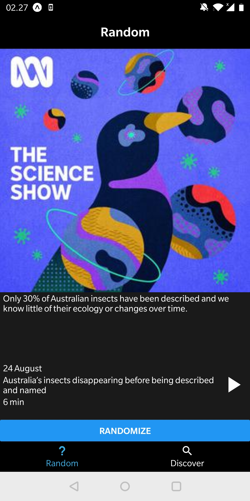
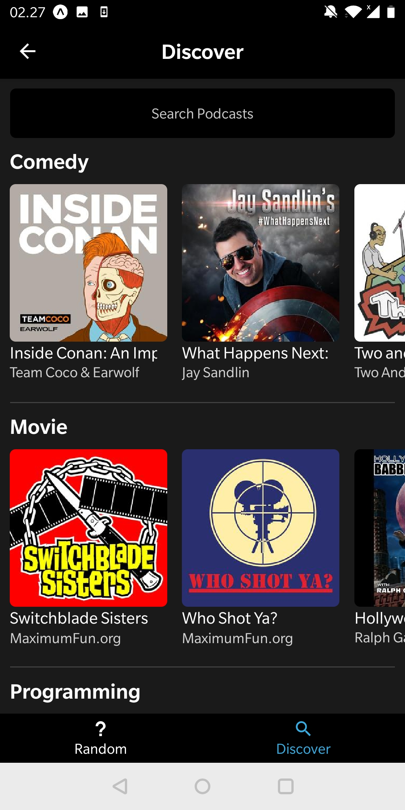

# WhatCast

## Table of Contents

1.  [Introduction](#introduction)
1.  [Installation](#installation)
1.  [API](#API)
1.  [Resources](#resources)

## Introduction

WhatCast is a mobile app developed in React Native that enables the user to discover new podcasts through the 'random' functionality, which will give them a random episode from a random podcast. Additionally the app also allows the user to search for podcasts they are interested in listening to, or browse the featured categories.

Note that it is required to have an API key from the [Listen Notes API](https://www.listennotes.com/) to fetch the podcast data.

The app is published for Beta test on Google Play. Please feel free to try it out. Any feedback would be greatly appreciated. You can find the app [here](https://play.google.com/apps/testing/com.kodekaiju.WhatCast).

## Screenshots





## Installation

Run `yarn` to install all dependencies.

Add your 'Listen Notes' API key in app.json under 'extra':

```
"extra": {
      "apiKey": ""
    }
```

Download the Expo app

Run 'yarn start' to run the app and scan the QR code with the Expo app

IMPORTANT: Do not commit and push your API key to GitHub

## Resources

- [React Native Documentation](http://facebook.github.io/react-native/)
- [React Documentation](https://reactjs.org/)
- [React-Redux Documentation](https://react-redux.js.org/)
- [Listen Notes API](https://www.listennotes.com/)
